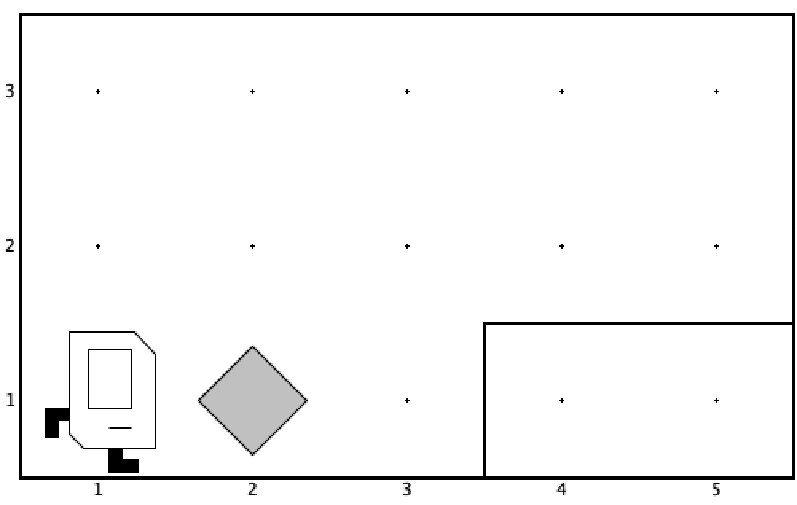
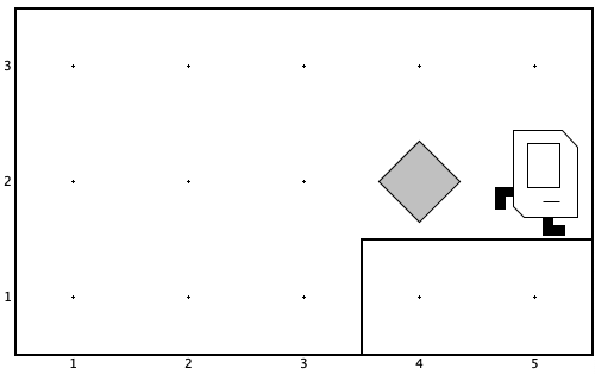
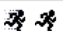

# პირველი პროგრამა
მოდი პირველი პროგრამა დავწეროთ, ამისათვის უკვე თითქმის ყველაფერი იცი. წარმოიდგინე რომ კარელი სურათზე მოცემულ სამყაროში ცხოვრობს

შენი მიზანია დაწერო პროგრამა, რომლის გაშვების შემდეგაც კარელი აიღებს (2,1) კოორდინატებზე არსებულ ბრილიანტს და დადებს (4,2) კოორდინატებზე, თვითონ კი მივა (5,2) კოორდინატებზე და დაამთავრებს მუშაობას. პროგრამის დასრულების შემდეგ სამყარო ასე უნდა გამოიყურებოდეს:


ალბათ გასაგებია, რომ ამის შესრულება შეიძლება შემდეგი ბრძანებების მიმდევრობით

```java
move
pickBeeper
turnLeft
move
turnLeft
turnLeft
turnLeft
move
move
putBeeper
move
```

ეს ჯერ არ არის პროგრამა. ეს არის ადამიანისთვის გასაგებ ენაზე დაწერილი ინსტრუქცია, რომელიც ამოცანას ჭრის. ამას სხვაგვარად ალგორითმი ჰქვია. ცხადია, იმისათვის, რომ ამოცანა გადაჭრა ალგორითმი უნდა იცოდე, თუმცა ეს საკმარისი არ არის. პროგრამა კარელისთვის გასაგებ ენაზე უნდა ეწეროს ამისათვის თითოეული ბრძანება უნდა გადავაკეთოთ მეთოდად, ანუ ბრძანებებს მივუმატოთ `();`. მივიღებთ

```java
move();
pickBeeper();
turnLeft();
move();
turnLeft();
turnLeft();
turnLeft();
move();
move();
putBeeper();
move();
```

ესეც არ არის გამართული პროგრამა. იმისათვის, რომ კარელმა ეს მეთოდები შეასრულოს მან უნდა იცოდეს საიდან უნდა დაიწყოს მეთოდების შესრულება. ამისათვის არსებობს სპეციალური `run` მეთოდი. ის არის პროგრამის დასაწყისი. ყველა პროგრამა `run` მეთოდით იწყება. იგი შემდეგნაირად გამოიყურება

```java
public void run() {
    move();
    pickBeeper();
    turnLeft();
    move();
    turnLeft();
    turnLeft();
    turnLeft();
    move();
    move();
    putBeeper();
    move();
}
```
ყურადღება მიაქციეთ გახსნილ და დახურულ ფიგურულ ფრჩხილებს, ისინი აღნიშნავენ `run` მეთოდის დასაწყისს და ბოლოს. იმისათვის, რომ ადამიანისთვის მარტივი დასანახი იყოს თუ რა მეთოდებია `run`-ის შიგნით, თითოეული მეთოდი შეწეულია `tab`-ით. `tab`-ებს და სხვა "თეთრ სიმბოლოებს"(space, enter, ...) არანაირი დატვირთვა არ აქვს და პროგრამის მიმდინარეობას არ ცვლის. მათ იყენებენ მხოლოდ იმისათვის, რომ ადამიანისთვის იყოს კოდი მარტივად დასანახი და გასაგები. თუ რას ნიშნავს `public void` შეგვიძლია ამ ეტაპზე დავიკიდოთ.

აი მიუთითე საიდან დაიწყოს კარელმა ბრძანებების შესრულება, მაგრამ ეს ჯერ ისევ არ არის გამართული პროგრამა. ჯერ პროგრამაში არსად გიხსენებია კარელი. სადღაც ხომ უნდა თქვა, რომ კარელის მოძრაობას აპირებ. ამისათვის უნდა შექმნა კლასი რომელიც `Karel`-ს "ავრცობს".

```java
public class FirstProgram extends Karel {
    public void run() {
        move();
        pickBeeper();
        turnLeft();
        move();
        turnLeft();
        turnLeft();
        turnLeft();
        move();
        move();
        putBeeper();
        move();
    }
}
```
ამ კოდში `FirstProgram` არის შენი პროგრამის სახელი. ისევ მიაქციე ყურადღბა გახსნილ და დახურულ ფიგურულ ფრჩხილს. `run` მეთოდი კლასის შიგნით უნდა იყოს.

```java
public class FirstProgram extends Karel {
    ...
}
```
კოდის ეს ნაწილი აღნიშნავს იმას, რომ შენ კარელის მოძრაობის სურვილი გაქვს. `FirstProgram`  შენი პროგრამის სახელია. ამის შემდეგ უკვე შეგიძლია თავისუფლად გამოიყენო მეთოდები `move()`, `pickBeeper()` და ა.შ. 

ეს კოდი ჯერ კიდევ არ არის საბოლოო ვერსია. რადგან შენ ჯერ კიდევ არ მიგითითებია `Karel`-ს რომ იყენებ, სადაური კარელია? ვინ შექმნა? საიდან მოვიდა? ამისათვის უნდა დაწერო შემდეგი კოდი
``` java
import stanford.karel.*;
```

სულ ეს არის. როგორც იქნა პირველი პროგრამა დავწერეთ! საბოლოო კოდი შემდეგნაირად გამოიყურება
```java
import stanford.karel.*;

public class FirstProgram extends Karel {
    public void run() {
        move();
        pickBeeper();
        turnLeft();
        move();
        turnLeft();
        turnLeft();
        turnLeft();
        move();
        move();
        putBeeper();
        move();
    }
}
```

აბა გაუშვი და შეამოწმე. ამისათვის კარელის პორექტში შექმენი `FirstProgram.java`(გაითვალისწინე, რომ ფაილის სახელი და პროგრამის სახელი ერთიდაიგივე უნდა იყოს). ჩააკოპირე ეს კოდი ამ ფაილში, შემდეგ კი დააკლიკე პროგრამის გაშვების ღილაკს



მარცხენა ღილაკი ბოლოს გაშვებულ პროგრამას გაუშვებს, მარჯვენა ღილაკი კი პროგრამის არჩევის საშუალებას მოგცემთ.

გაეშვა? მუშაობს? **ყოჩაღ! შენ უკვე პროგრამისტი ხარ!**

კონკრეტულად რას ნიშნავს `public`, `class`, `extends`, `void`, `import` ამ ეტაპზე დაიკიდე. ამ საკითხებს კიდევ მივუბრუნდებით. მნიშვნელოვანი რაც არის და რაც უნდა დაიმახსოვრო არის შემდეგი კოდი:

```java
import stanford.karel.*;

public class NameYourProgram extends Karel {
    public void run() {
        ...
    }
}
```

ეს არის საწყისი პროგრამის შაბლონი. ფაილის სახელი უნდა ემთხვეოდეს შენი პროგრამის სახელს(ამ მაგალითში შენი პროგრამის სახელია `NameYourProgram`). კოდი უნდა დაწერო `run` მეთოდის შიგნით.


