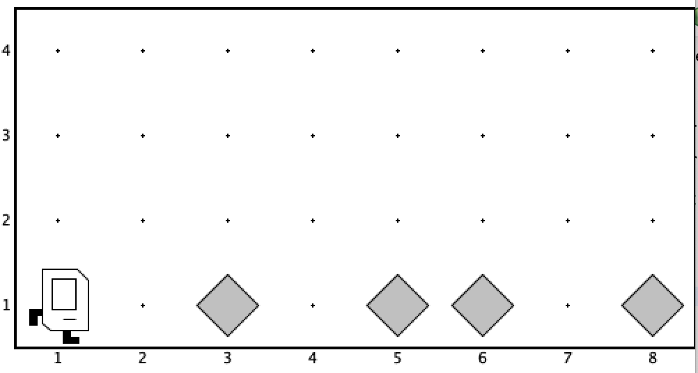

# if ოპერატორი

ხანდახან არის მომენტი, როდესაც რაღაც პირობის შემოწმება გირდება ხოლმე ერთხელ და არა მრავალჯერ, ისე როგორც `while ციკლშია`. ამ დროს გამოგადგება `if ოპერატორი`, რომელიც `for`-ის და `while`-ის მსგავსად შედგება თავისა და ტანისაგან. `if`-ის თავში შეგიძლია ჩაწერო ნებისმიერი პირობა, ხოლო მის ტანში ინსტრუქტიცების ნებისმიერი მიმდევრობა, შესაბამისად, თუ პირობა სრულდება, მაშინ კარელი შეასრულებს `if`-ის ტანში ჩამოწერილ ბრძანებებს, თუ პირობა არ სრულდება მაშინ არ შეასრულებს. `for`-ის და `while`-ის მსგავსად  `if`-ის ტანი გამოყოფილია გახსნილი და დახურული ფიგურული ფრჩხილებით `{}`  

მაგალითად შემდეგი კოდის შემთხვევაში
```java
if (beepersPresent()) {
    pickBeeper();
}
move();
```

კარელი შეამოწმებს და თუკი ბრილიანტზე დგას, მაშინ მას აიღებს (`if` დამთავრდება) და შემდეგ წინ გადაადგილდება, ხოლო თუკი ბრილიანტზე არ დგას, მაშინ `if`-ის ტანში არსებულ ბრძანებებს საერთოდ არ შეასრულებს და უბრალოდ გადაადგილდება.


`if ოპერატორს` გააჩნია `else` – "თუ არა" ბლოკიც, რომლის საშუალებითაც შეგიძლია შემდეგი ტიპის ლოგიკა გავავითარო - თუკი კარელი ბრილიანტზე დგას, მაშინ აიღოს ის, ხოლო **თუ არა**, მაშინ დადოს ბრილიანტი. კოდი შემდეგნაირად დაიწერება:
```java
if (beepersPresent()) {
    pickBeeper();
} else {
    putBeeper();
}
```

`if ოპერატორს` `else` ბლოკი შეიძლება ჰქონდეს, შეიძლება არა, ანუ, შეგიძლია დაუწერო, შეგიძლია არ დაუწერო. გასათვალისწინებელია, რომ ნებისმიერ შემთხვევაში შესრულდება ან `if ბლოკში` არსებული ბრძანებები(თუკი პირობა ჭეშმარიტია) ან `else ბლოკში` არსებული ბრძანებები(თუკი პირობა მცდარია). ამასთან ერთ-ერთი ბლოკი აუცილებლად შესრულდება(რადგან პირობა ან ჭეშმარიტი იქნება, ან მცდარი) და ორივე ვერასდროს შესრულდება.


## ოპერატორების ერთმანეთში ჩადგმა
თურმე შესაძლებელია `for`, `while` და `if` ერთმანეთში "ჩადგა" როგორც გინდა. ანუ შესაძლებელია, რომ `for ციკლის` ტანში იყოს `while`, რომლის ტანშიც იქნება `if`, რომლის ტანშიც იქნება ისევ `for` და ა.შ. როგორც მოგინდება. წარმოიდგინე, რომ სამყაროში პირველ ქუჩაზე სხვადასხვა ადგილებში მაქსიმუმ ერთი ბრილიანტი დევს (ზოგიერთ უჯრაზე შეიძლება საერთოდაც არ იდოს ბრილიანტი) და გინდა, რომ კარელმა ყველა ბრილიანტი აიღოს.



ამის გაკეთება შესაძლებელია შემდეგი კოდით.

```java
import stanford.karel.*;

public class IfWhileExample extends Karel {
    public void run() {
        while (frontIsClear()) {
            if (beepersPresent()) {
                pickBeeper();
            }
            move();
        }
        if (beepersPresent()) {
            pickBeeper();
        }
    }
}
```

