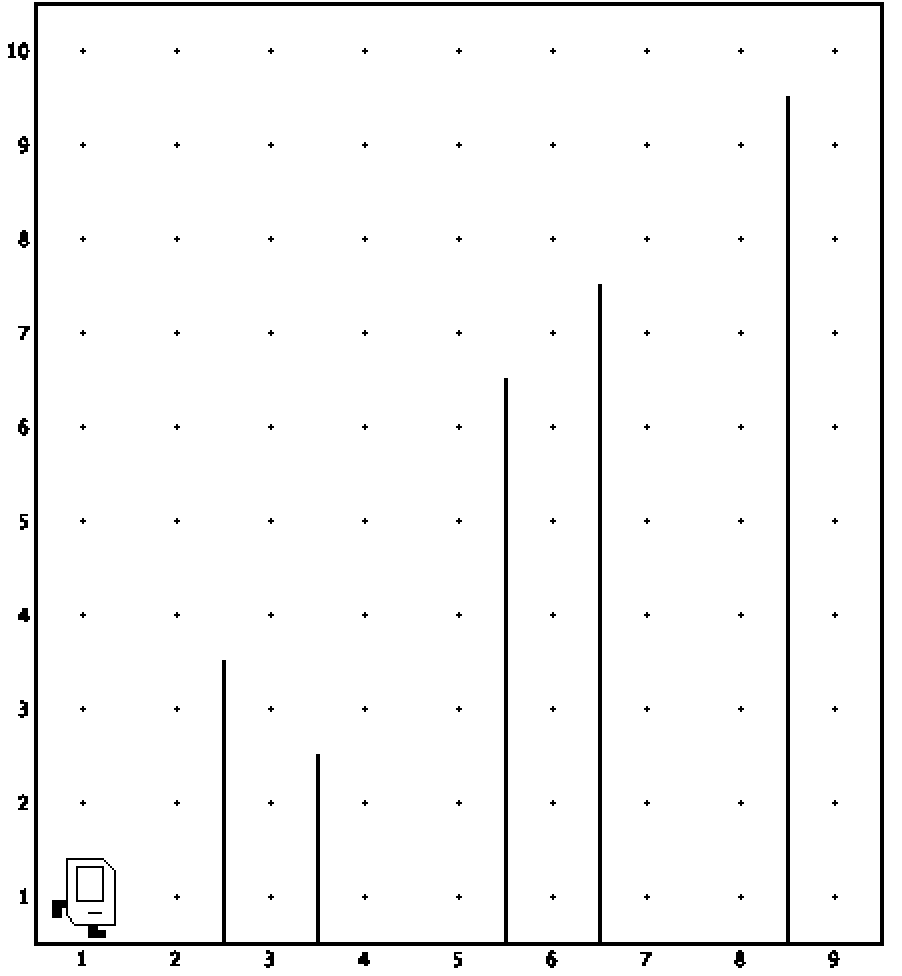

# ღობეებზე გადახტომის ამოცანა

მოდი ასეთი ამოცანა განვიხილოთ, წარმოიდგინე რომ კარელი ცხოვრობს სამყაროში რომლის სიგრძეც 9-ის ტოლია და ის (1,1) კოორდინატებზეა. ამ სამყაროში კარელილ გარდა არის ვერტიკალური ღობეები, წინასწარ არ იცი სად შეხვდება კარელს ვერტიკალური ღობე, ისიც არ იცი ამ ღობის სიმაღლე რამდენი იქნება. შენი ამოცანაა (1,1) წერილიდან (9,1) წერტილამდე მიიყვანო კარელი, ისე, რომ ყველა ღობეს გადახტუნო(იგულისხმება ის რომ კარელმა ღომეს შორიდან კი არ უნდა შემოუაროს, არამედ უნდა ავიდეს ღობისთავზე გადავიდეს ღობეზე და ჩამოვიდეს ქვემოთ)

