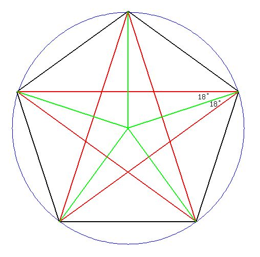

# Rotating Star

ამოცანა:
```
გამოვსახოთ ვარსკვლავი, რომელიც ტრიალებს
```

ამ ამოცანის სირთულე იმაში მდგომარეობს, რომ მცირედით მოითხოვს მათემატიკურ ცოდნას, თუმცა ძირითადი მიზანი არის ის, რომ სტუდენტს აჩვენოს განზოგადებით მიღებული საინტერესო თვისებები.

## როგორ შეგვიძლია დავხატოთ ვარსკვლავი?
ვარსკვლავები, რომლებსაც ვხატავთ, შედგება მრავალი ხაზისა და წვეროსგან, იქნება ეს ჩვეულებრივი 5-ქიმიანი, დავითის ვარსკვლავი(6-ქიმიანი) თუ სხვა. ყველა ასეთ ვარსკვლავში არსებობს გარკვეული კანონზომიერები: 
1. ყოველ მეზობელ(უახლოეს) წვეროებს შორის მოთავსებული კუთხე, რომელიც მდებარეობს ვარსკვლავის ცენტრზე, არის ტოლი
1. ყველა ვარსკვლავის წვერო არის მოთავსებული წრეწირზე, რომლის ცენტრიც არის თვითონ ამ ვარსკვლავის ცენტრი
1. ყოველი ვარსკვლავის მონაკვეთის მიერ გამოტოვებული წვეროების რაოდენობა(ანუ ხაზის საწყისი წვეროდან ბოლო წვერომდე არსებული მეზობელი წვეროების რაოდენობა) არის ტოლი

მაგ: 



სურათზე გამოსახულ 5-ქიმიან ვარსკვლავში მეზობელ მწვანე მონაკვეთებს შორის კუთხეები არის ტოლი(1), ყველა წვერო მოთავსებულია წრეწირზე(2) და რაც შეეხება გამოტოვებულ წვეროებს, აქ წითელი(ვარსკვლავის) მონაკვეთი ტოვებს ზუსტად 1 წერტილს(შეიძლება ითქვას 2-საც, თუ მეორე მხრიდან წავალთ, მაგრამ ორივე ერთნაირი ფორმის ვარსკვლავს წარმოქმნიდა)

ჩვენი მიზანი ახლა არის ამ ყველაფრის ჯავაში დაწერა და ვიზუალურად გამოტანა. ნაბიჯებად რომ დავყო:
1. გავწეროთ ყველა საჭირო ცვლადი ვარსკვლავის ყველა თვისების აღსაწერად
1. შევქმნათ მეთოდი, რომელიც შექმნის ამ ვარსკვლავისთვის საჭირო მონაკვეთებს და დაგვიბრუნებს მასზე სამუშაოდ(მის დასატრიალებლად) საჭირო ინფორმაციას
1. დავატრიალოთ ეს ვარსკვლავი

## საჭირო ცვლადები
```java
	GPoint center;
	int points;
	int jumpAm;
	int length;
	double speed;
```
- `center` - ვარსკვლავის ცენტრის კოორდინატები
- `points` - ვარსკვლავის წვეროების კოორდინატები
- `jumpAm` - გამოტოვებული წვეროების რაოდენობას +1(კოდის დასაწერად უფრო მარტივია)
- `length` - ვარსკვლავის რადიუსი
- `speed` - ვარსკვლავის ბრუნვის სიჩქარე(რადიანებში) 

## ვარსკვლავის შექმნა და ინფორმაციის დაბრუნება
```java
	/*
	 * Pre-Condition : None
	 * 
	 * Post-Condition : Displays the star and returns all the relevant information about it
	 */
	private Pair<ArrayList<GLine>, ArrayList<Double>> generateStar() {
		// Amount of radians between each corner
		double jumpDeg = 2 * Math.PI / points;

		ArrayList<GLine> lineRes = new ArrayList<GLine>();
		ArrayList<Double> degRes = new ArrayList<Double>();
		for (int i = 0; i < points; i++) {
			// Get cords of the start and end of a line
			GPoint start = getPointOnCircle(i * jumpDeg);
			// End corner is always jumpAm amount of corners after the starting corner
			GPoint end = getPointOnCircle((i + jumpAm) * jumpDeg);

			GLine curLine = new GLine(
					start.getX(), start.getY(), 
					end.getX(), end.getY());

			lineRes.add(curLine);
			degRes.add(i * jumpDeg);
			add(curLine);
		}
		return new Pair<ArrayList<GLine>, ArrayList<Double>>(lineRes, degRes);
	}
```

> ამ ფუნქციას გადაეცემა ზევით ნახსენები ცვლადები, მაგრამ სიმარტივის გამო გატანილია გლობალურად

თავდაპირველად `jumpDeg` ცვლადში ვინახავ თითო მეზობელ წვეროს შორის არსებულ კუთხეს. შემდეგ ვინახავთ 2 სიას, რომელიც აღწერს ამ ვარსკვლავს და გაგვიადვილებს მის ტრიალს. `lineRes` ინახავს თვითონ ვარსკვლავის შემადგენელ მონაკვეთებს, ხოლო `degRes` ყოველი ამ მონაკვეთის საწყისი წერტილის შესაბამის კუთხეს

> შესაძლებელია `degRes` ცვლადის გარეშეც ვარსკვლავის დატრიალება, მაგრამ ამ სიის არსებობა გვეხმარება იმაში, რომ ლოგიკა ძალიან არ გაგვირთულდეს დატრიალებისას

შემდეგ ვქმნით ვარსკვლავის მონაკვეთებს, რომლის რაოდენობაც ემთხვევა წვეროების რაოდენობას. ყოველი მონაკვეთის საწყისი წერტილი უნდა იყოს ამ წრეზე i-ური წერტილი, რომელსაც აქ ავღნიშნავ ცვლადით `start`, ხოლო ბოლო წერტილი არის `jumpAm` წერტილის მერე, ანუ (i+jumpAm)-ური წერტილი, რომელსაც ავღნიშნავ ცვლადით `end`. ამ წერტილების კოორდინატების გამოსათვლელად კიდევ ვიყენებ დამხმარე მეთოდს `getPointOnCircle` 

```java
	/*
	 * Pre-Condition : None
	 * 
	 * Post-Condition : Returns the coordinates of a point on the star circle at deg radians
	 */
	private GPoint getPointOnCircle(double deg) {
		return new GPoint(
				center.getX() + length * Math.cos(deg), 
				center.getY() + length * Math.sin(deg));
	}
```

ეს კოდი ნაკლებადაა დამოკიდებული პროგრამირებაზე და მეტად მათემატიკურ ცოდნაზე. აქ ხდება შემდეგი: მეთოდს გადაეცემა კუთხე(რადიანებში) და აბრუნებს `center` წერტილზე `length` რადიუსის მქონე წრეწირზე მაგ კუთხის შესაბამისი წერტილს. `getPointOnCircle(i * jumpDeg)` მეთოდის გამოძახებისას არგუმენტი i იმიტომ მრავლდება `jumpDeg` ცვლადზე, რომ i არის მხოლოდ წერტილის ნომერი, რომელიც ჩვენ მივანიჭეთ. ამ გამრავლებით ვიგებთ თუ ეს ნომერი რომელ კუთხეს მიესადაგება. მაგალითად, i=0 იქნება 0 რადიანი, i=1 იქნება jumpDeg რადიანი და ა.შ. ეს ყველა წერტილი კიდევ მეზობელი წერტილებისგან ტოლი კუთხეებით იქნება დაშორებული, როგორც საჭიროა ვარსკვლავისთვის 

შემდეგი კიდევ მარტივია. ვქმნი მონაკვეთს და ვამატებ სიაში `lineRes`, ხოლო თვითონ საწყისი წერტილის კუთხეს - `degRes`. ბოლოს კიდევ ამ 2 სიას ვაბრუნებთ.

> 2 ცვლადის დასაბრუნებლად ვიყენებ ცვლადის ტიპს `Pair`, რომელიც ინახავს 2 ცვლადს. ამ 2 ცვლადის ტიპი არ არის აუცილებელი, რომ ერთმანეთს დაემთხვეს, როგორც მაგალითში ვხედავთ

## ვარსკვლავის ტრიალი
```java
	/*
	 * Pre-Condition : Star has to be already generated
	 * 
	 * Post-Condition : Rotates the star by speed radians
	 */
	private void rotateStar(ArrayList<GLine> starLines, ArrayList<Double> starDegs) {
		double jumpDeg = 2 * Math.PI / points;
		for (int i = 0; i < points; i++) {
			// Calculate the next rotation degrees
			double nextDeg = (starDegs.get(i) + speed) % (2 * Math.PI);
			
			// Move line points
			GPoint nextStart = getPointOnCircle(nextDeg);
			GPoint nextEnd = getPointOnCircle(nextDeg + jumpAm * jumpDeg);

			starLines.get(i).setStartPoint(nextStart.getX(), nextStart.getY());
			starLines.get(i).setEndPoint(nextEnd.getX(), nextEnd.getY());
			starDegs.set(i, nextDeg);
		}
	}
```

შენახული ინფორმაციის გამო, დატრიალება ამ ვარსკვლავის ახლა არის მარტივი ოპერაცია. `rotateStar` მეთოდს მხოლოდ სჭირდება იცოდეს ის 2 სია, რომელიც ვარსკვლავის შექმნისას დავაბრუნეთ. იმისთვის, რომ ვარსკვლავი დატრიალდეს, ყველაზე ლოგიკური გზა იქნება წერტილების თანაბარი გადაადგილება ამ წრეწირზე, რისთვისაც საჭიროა ვიცოდეთ ყოველ იტერაციაში თუ რამდენი რადიანით გადაადგილდება წერტილი. ამ რაოდენობას ვინახავთ `speed` ცვლადში. 

თავდაპირველად ვიგებთ შემდეგ კუთხეს, რაც მობრუნების შემდეგ გვექნება. ეს მარტივია, საჭიროა მონაკვეთის კუთხეს დავუმატოთ მობრუნების სიჩქარე(განაშთვა არაა აუცილებელი). ამას ვაკეთებთ ყოველი მონაკვეთისთვის და თითოს მობრუნებისას შემდეგი საწყისი წერტილის კუთხეს ვიმახსოვრებთ `nextDeg` ცვლადში. ამის შემდეგ იგივეს ვიმეორებთ, რაც ზევით: ვიგებთ საწყისსა და საბოლოო წერტილებს მონაკვეთის და `generateStar` მეთოდში როცა ვქმნიდით ამ მონაკვეთებს, აქ მხოლოდ მნიშვნელობებს ვუცვლით. ბოლოს კიდევ სიაში ვცვლით ამ i-ური მონაკვეთის საწყისი წერტილის კუთხეს.

> ერთი დამაბნეველი ნაწილი შეიძლება იყოს `nextEnd` ცვლადში არგუმენტს რატომ ვუმატებთ jumpAm * jumpDeg, მაგრამ ვიცით, რომ ეს არის საბოლოო წერტილი, ანუ ის საწყისი წერტილისგან უნდა იყოს `jumpAm` წერტილით დაშრებული, ხოლო თითო წერტილს შორის არის `jumpDeg` სიდიდის კუთხე