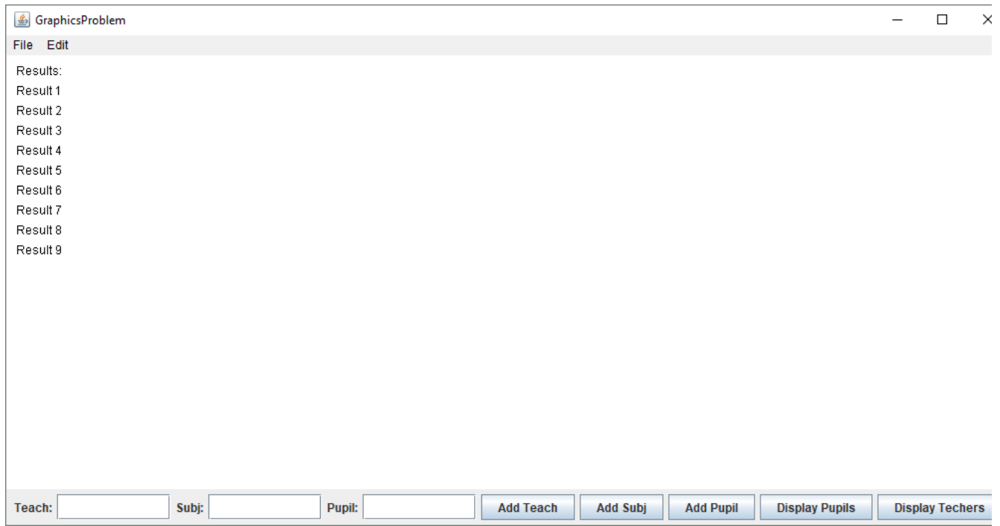

# ამოცანები

### 1. MoveKarel
```
კარელი დგას 1x1 უჯრაზე. 3x1 უჯრაზე დევს ბრილიანტი, კარელმა ბრილიანტი უნდა
გადაიტანოს 4x1 უჯრაზე და დაამთავროს მუშაობა.
```

### 2. MoveBeepers
```
კარელი დგას 1x1 უჯრაზე. 5x1 უჯრაზე დევს 10 ცალი ბრილიანტი, კარელმა ათივე
ბრილიანტი უნდა გადაიტანოს 6x1 უჯრაზე.
```

### 3. EndOfTheStreet
```
კარელი დგას 1x1 უჯრაზე, გაიყვანეთ იგი პირველი ქუჩის ბოლომდე. გაითვალისწინეთ, რომ
სამყაროს ზომა არ იცით. თქვენი პროგრამა უნდა მუშაობდეს ნებისმიერი ზომის
სამყაროსათვის.
```

### 4. FillRaw
```
კარელი დგას 1x1 უჯრაზე, შეავსებინეთ მას პირველი ქუჩა ბრილიანტებით. ანუ პირველი
ქუჩის ყველა უჯრაზე უნდა იდოს ზუსტად ერთი ბრილიანტი. ჩათვალეთ რომ საწყის
სამყაროში ბრილიანტები არსად არ დევს.
```

### 5. FillFirstRow
```
კარელი დგას 1x1 უჯრაზე, შეავსებინეთ მას პირველი ქუჩა ბრილიანტებით. ანუ პირველი
ქუჩის ყველა უჯრაზე უნდა იდოს ზუსტად ერთი ბრილიანტი. ჩათვალეთ რომ საწყისი
სამყარო ცარიელი არ არის და გარკვეულ(ჩვენთვის უცნობ) უჯრებში თითო(მხოლოდ ერთი)
ბრილიანტი დევს.
```

### 6. Addition
```
კარელმა უნდა შეკრიბოს ორი რიცხვი, 2x1 უჯრაზე დევს n ცალი ბრილიანტი, 3x1 უჯრაზე m
ცალი ბრილიანტი, კარელმა 4x1 უჯრაზე უნდა დადოს n+m ბრილიანტი. ჩათვალეთ, რომ
კარელს ჩანთაში უსასრულო რაოდენობის ბრილიანტი აქვს.
```

### 7. FillWorld
```
კარელი დგას 1x1 უჯრაზე, შეავსებინეთ მას მთელი სამყარო თითო ბრილიანტით. ანუ მთელ
სამყაროში ყველა უჯრაზე უნდა იდოს ზუსტად ერთი ბრილიანტი. ჩათვალეთ რომ საწყისი
სამყარო ცარიელი არ არის და გარკვეულ(ჩვენთვის უცნობ) უჯრებში თითო(მხოლოდ ერთი)
ბრილიანტი დევს. ამასთან გაითვალისწინეთ, რომ სამყაროს ზომები თქვენთვის უცნობია და
თქვენი პროგრამა უნდა მუშაობდეს ნებისმიერი ზომის სამყაროსათვის.
```

### 8. Subtraction
```
კარელმა უნდა გამოაკლოს ორი რიცხვი, 2x1 უჯრაზე დევს n ცალი ბრილიანტი, 3x1 უჯრაზე
m ცალი ბრილიანტი, კარელმა 4x1 უჯრაზე უნდა დადოს n-m ბრილიანტი. ჩათვალეთ, რომ
კარელს ჩანთაში უსასრულო რაოდენობის ბრილიანტი აქვს და ჩათვალეთ, რომ n>=m.
```

### 9. Multiplication
```
კარელმა უნდა გაამრავლოს ორი რიცხვი, 2x1 უჯრაზე დევს n ცალი ბრილიანტი, 3x1 უჯრაზე
m ცალი ბრილიანტი, კარელმა 4x1 უჯრაზე უნდა დადოს n * m ბრილიანტი. ჩათვალეთ, რომ
კარელს ჩანთაში უსასრულო რაოდენობის ბრილიანტი აქვს.
```

### 10. Division
```
კარელმა უნდა გაყოს ორი რიცხვი, 2x1 უჯრაზე დევს n ცალი ბრილიანტი, 3x1 უჯრაზე m
ცალი ბრილიანტი, კარელმა 4x1 უჯრაზე უნდა დადოს n / m ბრილიანტი. ჩათვალეთ, რომ n
ზუსტად იყოფა m-ზე და კარელს ჩანთაში უსასრულო რაოდენობის ბრილიანტი აქვს.
```

### 11. Maze
```
მოცემული გაქვთ სამყარო შემთხვევითად განლაგებული კედლებით. კარელი დგას 1x1
უჯრაზე. თქვენი მიზანია კარელი მიიყვანოთ სამყაროს მარჯვენა ზედა კუთხეში. ჩათვალეთ,
რომ კედლები ისეა განლაგებული, რომ გზა არსებობს.
```

### 12. House
```
გრაფიკული პროგრამის გამოყენებით დახატეთ სახლი.
```

### 13. LineInTheMiddle
```
დაწერეთ პროგრამა, რომლიც ეკრანის შუაში გაავლებს ჰორიზონტალურ ხაზს.
```

### 14. Robot
```
დახატეთ რობოტის სახე ფანჯრის ცენტრში.
```

### 15. Average
```
კონსოლიდან წაიკითხეთ ორი მთელი რიცხვი და დაბეჭდეთ მათი საშუალო არითმეტიკული.
```

### 16. HarmonicMean
```
კონსოლიდან წაიკითხეთ სამი მთელი რიცხვი და დაბეჭდეთ მათი საშუალო ჰარმონიული.
შეგახსენებთ, რომ სამი რიცხვის საშუალო ჰარმონიულის გამოთვლის ფორმულა არის 
1 / (1/a + 1/b + 1/c)
```

### 17. RealNumber
```
კონსოლიდან წაიკითხეთ ნამდვილი რიცხვი და დაბეჭდეთ მისი მთელი ნაწილი და მისი
წილადი ნაწილი. მაგალითად მომხმარებელმა თუ შეიყვანა 3.14 თქვენმა პროგრამამ უნდა
დაბეჭდოს 3 და 0.14
```

### 18. Max2Ints
```
კონსოლიდან წაიკითხეთ ორი მთელი რიცხვი და დაბეჭდეთ მათ შორის მაქსიმალური.
```

### 19. ForN
```
კონსოლიდან წაიკითხეთ მთელი რიცხვი n და შემდეგ n ჯერ დაბეჭდეთ “hello ” + i, სადაც i
იცვლება 0 დან n-1 მდე.
```

### 20. SumN
```
კონსოლიდან წაიკითხეთ n, შემდეგ წაიკითხეთ n ცალი მთელი რიცხვი და დაბეჭდეთ ჯამი
```

### 21. EmptyGrid
```
ხაზებით ბადის დახატვა 10x10-ზე
```

### 22. ChessBoard
```
ჭადრაკის დაფის დახატვა 8x8 ზე
```

### 23. Sum1N
```
მომხმარებელს შეყავს მთელი რიცხვი n, პროგრამამ უნდა დაბეჭდოს 1 დან n მდე რიცხვების
ჯამი
```

### 24. NumberOfDivisors
```
მომხმარებელს შეყავს მთელი რიცხვი n, პროგრამამ უნდა დაბეჭდოს n ის გამყოფების
რაოდენობა
```

### 25. LeastCommonMultiple
```
მომხმარებელს შეჰყავს ორი რიცხვი თქვენმა პროგრამამ უნდა დაბეჭდოს ამ ორი რიცხვის
უმცირესი საერთო ჯერადი.
```

### 26. GreatestCommonDivisor
```
მომხმარებელს შეჰყავს ორი რიცხვი თქვენმა პროგრამამ უნდა დაბეჭდოს ამ ორი რიცხვის
უდიდესი საერთო გამყოფი
```

### 27. Power
```
მომხმარებელს შეყავს n და m დაბეჭდეთ n^m
```

### 28. CountEvenNumbers
```
მომხმარებელს შეყავს დადებითი რიცხვები, მანამ სანამ არ შეიყვანს -1 ს, დაბეჭდეთ
რაოდენობა რამდენი ლუწი რიცხვი შეყვანა მომხმარებელმა.
```

### 29. Fibonacci
```
მოხმარებელს შეყავს მთელი რიცხვი n, პროგრამამ უნდა დაბეჭდოს ფიბონაჩის მიმდევრობის
მე n წევრი.
```

### 30. ReverseInt
```
მომხმარებელს შეყავს მთელი რიცხვი, დაბეჭდეთ რიცხვი რომელიც მიიღება ციფრების
შებრუნებით, 1256 -> 6521
```

### 31. Prime
```
დაწერეთ პროგრამა რომელიც დაადგენს შეყვანილი რიცხვი მარტივია თუ არა
```

### 32. AllPrimes
```
დაწერეთ პროგრამა რომელიც იპოვის და დაბეჭდავს 1000000 მდე ყველა მერტივ რიცხვს
```

### 33. RandomCircle
```
დაწერეთ პროგრამა რომელიც კანვასზე დახატავს შემთხვევითი ფერის მქონე წრეწირს,
რაიდიუსიც შემთხვევით აირჩეით შეზღუდული რეინჯიდან.
```

### 34. RandomCircles
```
კანვასზე დახატეთ 1000 შემთხვევითი რადიუსის მქონე შემთხვევითი ფერით გაფერადებული
წრე, შემთხვევით კოორდინატებზე.
```

### 35. TossesForHead
```
თქვენი ამოცანაა გააკეთოთ მონეტის აგდების სიმულაციები და დათვალოთ საშუალოდ
რამდენჯერ უნდა ავაგდოთ მონეტა რათა ამოვიდეს ბორჯღალო
```

### 36. TossesFor3Heads
```
თქვენი ამოცანაა გააკეთოთ მონეტის აგდების სიმულაციები და დათვალოთ საშუალოდ
რამდენჯერ უნდა ავაგდოთ მონეტა რათა 3-ჯერ ზედიზედ ამოვიდეს ბორჯღალო.
```

### 37. RouletteSim
```
რულეტკა, მომხმარებელს შეყავს 0 დან 36 მდე რიცხვი, შემდეგ ხდება რულეტკის
დატრიალების სიმულაცია, კონსოლში უნდა დაიბეჭდოს ამოსული რიცხვი და მოიგო თუ არა
დადებულმა რიცხვმა
```

### 38. LoseEverything
```
მოხმარებელს აქვს საწყისი თანხა 1000, თამაშობს მანამ სანამ არ წააგებს ყველაფერს. ყოველ
ჯერზე შეყავს ფსონის თანხა და რიცხვი რომელზეც დებს. ხდება რულეტკის დატრიალების
სიმულაცია(0-დან 36-მდე შემთხვევითი რიცხვი), მოგების შემთხვევაში მოთამაშეს
უორმაგედბა დადებული თანხა წაგების შემთხვევაში კი მოთამაშე კარგავს დადებულ თანხას.
მოთამაშე მოგებულია მაშინ თუ რულეტკაზე ამოსული რიცხვი ემთხვევა მის მიერ დადებულ
რიცხვს. პროგრამა ყოველ მოქმედებაზე უნდა ბეჭდავდეს შესაბამის შეტყობინებას, ადვილად
რომ გაერკვეს მოთამაშე, რა რიცხვი ამოვიდა, რამდენი წააგო, რამდენი მოიგო, რამდენი აქვს
ბალანსი.
```

### 39. MovingBall
```
დაწერეთ პროგრამა სადაც იქნება კანვასზე ბურთის მოძრაობა მარცხენა კედლის შუა
წერტილიდან მარჯვენა კედლამდე.
```

### 40. InfinitlyMovingBall
```
წინა ამოცანის გაგრძელება, დაამატეთ ვერტიკალური კედლებიდან ასხლეტვა. ანუ ბურთი
მოძრაობს მარცხენა კედლიდან მარჯვნივ. როგორც კი მარჯვენა კედელს დაეტაკება იმავე
სიჩქარით უნდა გააგრძელოს მოძრაობა მაჯვენა კედლიდან მარცხნივ. როგორც კი მარცხენა
კედელს დაეტაკება უნდა გააგრძელოს მარჯვნივ და ა.შ. უსასრულოდ.
```

### 41. Pencil
```
გააკეთეთ Paint-ის ფანქრის ანალოგიური ხელსაწყო. კერძოდ, მაუსის ყოველ მოძრაობაზე
ეკრანზე დაამატეთ გაფერადებული წრეწირები იმავე წერტილში სადაც მაუსი მდებარეობს.
```

### 42. PaintLine
```
Paint-ის მონაკვეთის ხატვის გაკეთება, ჯერ აჭერ მაუსს, ფიქსირდება ერთი წვერო, მერე
მაუსის მოძრაობისას მონაკვეთიც მოძრაობს რადგან მეორე წვერო არაა დაფიქსირებული და
კლიკით ფიქსირდება მეორე წვეროც.
```

### 43. DragCircle
```
წრეწირის drag ით გადაადგილება.
```

### 44. DropBall
```
მაუსის კლიკზე იმავე ადგილზე ჩნდება ბურთი და იწყებს ვარდნას ძირს, თუ მაუსს სხვა
ადგილზე ვაკლიკებ ბურთი გადადის ახალ ადგილზე და იქედან იწყებს ვარდნას
```

### 45. SymbolOccurrences
```
მომხმარებელს კონსოლიდან შეჰყავს ტექსტი და სიმბოლო, თქვენმა პროგრამამ უნდა იპოვოს
რამდენჯერ გვხვდება მოცემულ ტექსტში მოცემული სიმბოლო
```

### 46. MostFrequentSymbol
```
დაწერეთ მეთოდი რომელსაც გადაეცემა სტიგნი და რომელიც აბრუნებს ამ სტრინგში
ყველაზე ხშირ სიმბოლოს.
```

### 47. Polindrom
```
დაწერეთ პრედიკატ მეთოდი რომელსაც გადაეცემა სტრინგი და რომელიც დაადგენს არის თუ
არა მოცემული ტექსტი პალინდრომი
```

### 48. SymbolStats
```
კონსოლიდან შეგყვავს ტექსტი პროგრამამ უნდა დაბეჭდოს სტატისტიკა რომელი სიმბოლო
რამდენჯერ გვხვდება
```

### 49. StringToInteger
```
დაწერეთ stringToInteger მეთოდი, რომელსაც გადაეცემა სტრინგი და აბრუნებს მთელ რიცხვს.
ჩათვალეთ, რომ გადაცემული სტრინგი მხოლოდ ციფრებისგან შედგება და არ იწყება 0-ით.
მაგალითად “234” გადაცემის შემთხვევაში მეთოდმა უნდა დააბრუნოს 234. ასევე ჩათვალეთ,
რომ დაბრუნებული მნიშვნელობა დადებითია და ეტევა int-ში.
```

### 50. NumberOfWords
```
შეყვანილ ტექსტში დათვალეთ სიტვყების რაოდენობა, ტოკენაიზერის საშუალებით.
```

### 51. RemoveDuplicated
```
დაწერეთ მეთოდი რომელიც გადაცემული ტექსტიდან შლის დუბლირებულ სიმბოლოებს,
ანუ თუ ტექსტიში რომელიმე სიმბოლო მეორდება, უნდა დარჩეს მხოლოდ ყველაზე მარცხენა.
```

### 52. PrintThyself
```
დაწერეთ პროგრამა რომელიც წაიკითხავს თავის თავს ფაილიდან და დაბეჭდავს კონსოლში
```

### 53. FileStats
```
დაწერეთ პროგრამა რომელიც ფაილიდან წაიკითხავს ტექტს და დათვლის შემდეგ
სტატისტიკებს: სიმბოლოების რაოდენობა, სიტყვების რაოდენობა(სიტყვები სფეისებით
გამოყოფილია ერთმანეთისგან), წინადადებების რაოდენობა. რამდენი წინდადება მთავრდება
წერტილით, კითხვის ნიშნით და ძახილის ნიშნით?
```

### 54. Max2Numbers
```
კონსოლიდან შეგყვავს n და შემდეგ n ცალი მთელი რიცხვი, იპოვეთ და დაბეჭდეთ ამ
რიცხვებს შორის ორი მაქსიმალური რიცხვი.
```

### 55. Sorted
```
კონსოლიდან შეგყვავს n და შემდეგ n ცალი მთელი რიცხვი, გაარკვიეთ შეყვანილი რიცხვები
არის თუ არა ზრდადობით დალაგებული. თუკი არის დაბეჭდეთ “sorted” თუ არა მაშინ
დაბეჭდეთ “not sorted”.
```

### 56. Sort
```
კონსოლიდან შეგყვავს n და შემდეგ n ცალი მთელი რიცხვი, დაალაგეთ რიცხვები
ზრდადობით და დაბეჭდეთ.
```

### 57. Anagrams
```
დაწერეთ მეთოდი, რომელსაც გადაეცემა ორი სტრინგი და აბრუნებს true-ს თუკი ეს ორის
სტრინგი ერთმანეთის ანაგრამაა, ხოლო წინააღმდე შემთხვევაში აბრუნებს false-ს. ჩათვალეთ,
რომ ორივე სტრინგი მხოლოდ ლათინური ალფავიტის პატარა ასოებისგან შედგება.
იმპლემენტაცია გააკეთეთ მასივების გამოყენებით შემდეგი ალგორითმით: თითოეული
სიტყვისთვის დათვალეთ თითოეული სიმბოლოს რაოდენობა(‘a’-‘z’) და შეინახეთ მასივში.
შემდეგ შეადარეთ ერთმანეთს მასივები.
```

### 58. MagicMatrix
```
მატრიცას ეწოდება მაგიური თუკი ის კვადრატულია(n x n-ზე) და მასში არის ყველა
რიცხვი 1-დან n^2-ის ჩათვლით. თქვენი მიზანია დაწეროთ magicMatrix მეთოდი
რომელიც შეამოწმებს არის თუ არა მატრიცა მაგიური და თუკი მაგიურია მაშინ
დააბრუნებს true-ს თუ არა მაშინ false-ს.
```

### 59. MaxRect
```
გადმოგეცემათ nxm-ზე მატრიცა რომელშიც მხოლოდ 0-ები და 1-ები წერია. მეთოდმა
უნდა დააბრუნოს ამ მატრიცის ყველაზე დიდი ქვემართკუთხედის
ზომა(ელემენტების რაოდენობა) რომელიც მხოლოდ 1-ებისგან შედგება.
მაგალითად:
01100100
01111100
00111100
00111100
ამ მატრიცაში ყველაზე დიდი შიდა მართკუთხედი, რომელიც სულ ერთიანებისგან
შედგება არის 12 ზომის:
01 1001 00
01*1111*00
00*1111*00
00*1111*00
შესაბამისად ამ მატრიცაზე მეთოდმა უნდა დააბრუნოს 12. ჩათვალეთ რომ
გადმოცემულ მატრიცაში ერთი უჯრა მაინც იქნება რომელშიც წერია 1.
```

### 60. ReverseInts
```
კონსოლიდან შეგვყავს რიცხვები მანამ სანამ არ შეიყვანთ -1-ს, დაბეჭდეთ შეყვანილი
რიცხვები შებრუნებული მიმდევრობით.
```

### 61. SumOfM
```
კონსოლიდან შეგვყავს რიცხვი m და n, შემდეგ n ცალი რიცხვი. პროგრამამ უნდა იპოვოს
შეყვანილი რიცხვებიდან წყვილი რომელთა ჯამი არის m.
```

### 62.NumberOfNames
```
კონსოლიდან შეგვყავს სახელები, მანამ სანამ არ შევიყვანთ ცარიელ სტრინგს. დაბეჭდეთ
სახელი და მის გასწვრივ რაოდენობა რამდენჯერ შევიყვანეთ ეს სახელი.
```

### 63. Frendliest
```
კონსოლიდან შეგვყავს წყვილ-წყვილად მეგობრების სახელები, მანამ სანამ არ შევიყვანთ
ცარიელ სტრინგს. დაბეჭდეთ იმ ადამიანის სახელი ვისაც ჰყავს ყველაზე მეტი მეგობარი.
მეგობრობა შეიძლება იყოს ცალმხრივი. თუკი შევიყვანთ A-ს და B-ს, ეს ნიშნავს, რომ A არის
B-ს მეგობარი, მაგრამ B შეიძლება არ იყოს A-ს მეგობარი.
```

### 64. ListOfFriends
```
63-ე ამოცანის გაგრძელება, დაბეჭდეთ თითოეული შეყვანილი სახელი და მის გასწვრივ
მძიმით გამოყოფილი მეგობრების სია.
```

### 65. Popular
```
63-ე ამოცანის გაგრძელება. დაბეჭდეთ ადამიანი რომელსაც ყველაზე მეტი ადამიანი
ემეგობრება
```

### 66. Stranger
```
63-ე ამოცანის გაგრძელება. დაბეჭდეთ ორი ადამინი რომელთაც არ ჰყავთ საერთო მეგობრები
```

### 67. Photo
```
გააკეთეთ ფოტოების აპლიკაცია. აპლიკაციას უნდა ჰქონდეს ტექსფილდი სადაც შეიძლება
ფოტოს(ფაილის) მისამართის ჩაწერა. ენტერზე დაჭერის შემდეგ ეს ფოტო უნდა გამოჩნდეს
ფანჯრის ცენტრში.
```

### 68. Chat
```
თქვენი ამოცანაა გრაფიკული პროგრამის საშუალებით გააკეთოთ ჩატი. ფანჯარაზე, SOUTH
რეგიონზე უნდა გქონდეთ ერთი ტექსტფილდი და ერთი ღილაკი ტექტით Enter.
ტექსტფილდში ტექსტის შეყვანის მერე Enter ჭილაკზე დაჭერით ტექსტი უნდა
იწერებოდეს(იხატებოდეს) კანვასზე ხოლო ტექსტფილდში კი ტექსტი იშლებოდეს. ხელახლა
ტექსტის შეყვანისას ახალი ტექსტი წინა ტექსტის ქვემოთ უნდა გამოცნდეს(როგორც ჩატში
ხდება ხოლმე. თუკი ტექსტი ჩაცდება ეკრანს არაუშავს.
```

### 69. ScrollChat
```
68 ამოცანის გაგრძელება. დაამატეთ სქროლი. თუკი ტექსტი ჩაცდება ეკრანს მაშინ ახალი
ტექსტი მაინც უნდა გამოჩნდეს ეკრანის ბოლოში, შესაბამისად სულ პირველად შეყვანილი
ტექსტი გაქრება ეკრანიდან.
```

### 70. ResizableGrid
```
მთელ ფორმაზე ბადის დახატვა, ისე რომ ფორმის ზომის ცვლილებაზე ბადის უჯრის ზომაც
პროპორციულად იზრდებოდეს.
```

### 71. School
```
თქვენი მიზანია დაწეროთ School კლასი, რომლის საშუალებითაც შევძლებთ
უნივერსიტეტის მართვას. კლასს უნდა ჰქონდეს კონსტრუქტორი და 5 public მეთოდი.

public School()
კონსტრუქტორს არაფერი არ გადაეცემა. აქ შეგიძლიათ ინიციალიზაცია გაუკეთოთ
თქვენთვის საჭირო ცვლადებს.

public void addTeacher(String teacher)
addTeacher მეთოდის საშუალებით შეგიძლიათ სკოლას დაამატოთ ახალი
მასწავლებელი. მეთოდს გადაეცემა მასწავლებლის სახელი. შეგიძლიათ ჩათვალოთ,
რომ მასწავლებლის სახელი უნიკალურია.

public void addSubject(String teacher, String subject)
addSubject მეთოდის საშუალებით შეგიძლიათ მასწავლებელს დაუმატოთ საგანი.
მეთოდს გადაეცემა მასწავლებლის სახელი და საგნის სახელი. ჩათვალეთ, რომ საგნის
სახელი უნიკალურია. ერთი და იგივე მასწავლებელი შეიძლება რამდენიმე საგანს
კითხულობდეს, ასევე ერთსა და იმავე საგანს შეიძლება რამდენიმე მასწავლებელი
კითხულობდეს ერთდროულად.
თუკი teacher სახელის მქონე მასწავლებელი არ არის აქამდე დამატებული, მაშინ
მეთოდმა არაფერი არ უნდა გააკეთოს.

public void addPupil(String pupil, String subject)
addPupil მეთოდის საშუალებით შეგიძლიათ საგანზე დაამატოთ მოსწავლე. ერთი და
იგივე მოსწავლე შეიძლება ერთ ან რამდენიმე საგანს სწავლობდეს.

public Iterator<String> getTeachers(String pupil)
getTeachers მეთოდს გადაეცემა მოსწავლის სახელი და მან უნდა დააბრუნოს ამ
მოსწავლის ყველა მასწავლებელზე იტერატორი. ანუ მხოლოდ იმ მასწავლებლების
სახელები, რომლებიც ასწავლიან იმ საგნებს, რომლებზეც მოსწავლეა
დამატებული(სწავლობს). თუკი pupil სახელის მოსწავლე არ გვყავს მაშინ მეთოდმა
უნდა დააბრუნოს null.

public Iterator<String> getPupils(String teacher)
getPupils მეთოდს გადაეცემა მასწავლებლის სახელი და მან უნდა დააბრუნოს ამ
მასწავლებლის ყველა სტუდენტზე იტერატორი. ანუ მხოლოდ იმ სტუდენტების
სახელები, რომლებიც მის რომელიმე საგანს სწავლობენ. თუკი teacher სახელის მქონე
ლექტორი არ გვყავს მაშინ მეთოდმა უნდა დააბრუნოს null.

public void removeTeacher(String teacher)
მეთოდმა უნდა წაშალოს მასწავლებლის შესახებ ყველა ინფორმაცია. ამ მეთოდის
გამოძახების, შემდეგ getTeachers მეთოდმა არ უნდა დააბრუნოს teacher სახელი არც
ერთი სტუდენტისთვის.
```

### 72. SchoolGraphics
```
ჩათვალეთ რომ წინა ამოცანაში აღწერილი School კლასი უკვე არსებობს და შეგიძლიათ
გამოყენება. დაწერეთ გრაფიკული პროგრამა რომელიც მოგვცემს საშუალებას დავამატოთ
სკოლის შესახებ მონაცემები და შემდეგ გავფილტროთ. სურათზე ნაჩვენებია თუ როგორ უნდა
გამოიყურებოდეს გრაფიკული პროგრამა:
```


```
1. Add Teach ღილაკზე დაჭერით სკოლას უნდა დაემატოს Teach ველში
შეყვანილი სახელის მქონე მასწავლებელი

2. Add Subj ღიალაკზე დაჭერით Teach ველში შეყვანილი სახელის მქონე
მასწავლებელს უნდა დაემატოს Subj ველში შეყვანილი სახელის მქონე საგანი

3. Add Pupil ღილაკზე დაჭერით Subj ველში შეყვანილ საგანს უნდა დაემატოს
Pupil ველში შეყვანილი სახელის მქონე სტუდენტი

4. Display Pupils ღილაკზე დაჭერის შემდეგ, პროგრამამ უნდა გაასუფთაოს ეკრანი
და გამოიტანოს ყველა ისეთი მოსწავლის სახელი, რომელსაც ასწავლის Teach
ველში შეყვანილი სახელის მქონე მასწავლებელი

5. Display Teachers ღილაკზე დაჭერით, პროგრამამ უნდა გაასუფთაოს ეკრანი და
გამოიტანოს ყველა ისეთი მასწავლებლის სახელი, რომლებიც ასწავლიან Pupil
ველში შეყვანილი სახელის მქონე მოსწავლეს.

თითოეულ ღილაკზე დაჭერის შემდეგ, ტექსტური ველების მნიშვნელობები უნდა
გასუფთავდეს. Result სათაური უნდა დაიხატოს, (RESULT_X, LINE_H) წერტილში,
ხოლო გაფილტრვის შედეგები იგივე ვერტიკალში ერთმანეთისგან LINE_H-ით
დაშორებით. კოდი დაწერეთ SchoolGraphics.java ფაილში.
```